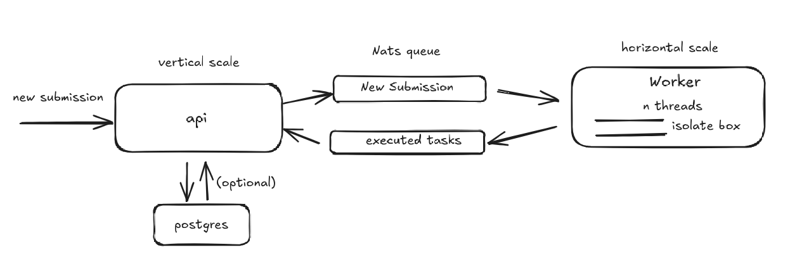

# Secure Code Execution Engine in Rust

A secure, sandboxed code execution engine written in Rust, designed to safely run untrusted user-submitted code using [`isolate`](https://github.com/ioi/isolate). This system is ideal for online judges, coding platforms, or automated assessment tools.

## Architecture


## ✨ Features

- 🛡️ **Secure Sandbox:** Uses Linux namespaces, control groups (cgroups), and the `isolate` utility to safely execute code.
- 🔤 **Multi-language Support:** Execute code in languages like Python, C, C++, and more, using configurable compile/run commands.
- 📦 **Resource Limits:** Enforces CPU time, wall time, memory, stack size, file size, and process count limits.
- 📥 **Standard I/O Handling:** Supports input via stdin and captures stdout/stderr for validation.
- 📊 **Metadata Collection:** Collects detailed execution metadata such as memory used, time taken, exit code, signals, and more.
- 🔁 **Multiple Runs:** Runs submissions multiple times and averages time/memory as per configuration.
- 🔄 **Callback Support:** Can notify external systems via HTTP callback on execution completion.

## 🚀 Quick Start

### Prerequisites

- Rust (stable)
- `isolate` installed with `sudo` access  
  Install it on Pop!_OS / Ubuntu:

  ```bash
  sudo apt install isolate
  ```

### Clone & Build

```bash
git clone https://github.com/Karthik-S-Salian/executor
cd yourrepo
cargo build --release
```

### Run Server

```bash
sudo -E cargo run
```

> ⚠️ `sudo` is required because `isolate` needs root access to create sandboxes.

## 📡 API Endpoint

### `POST /submissions/new`

Send a code submission for execution.

#### Sample Request

```bash
curl -X POST http://localhost:3000/submissions/new \
  -H 'Content-Type: application/json' \
  -d '{
    "source_code": "print(\"hello world\")",
    "language": "py",
    "stdin": "",
    "expected_output": "hello world",
    "cpu_time_limit": 1,
    "memory_limit": 1000000,
    "redirect_stderr_to_stdout": true,
    "enable_network": false
  }'
```

## 🧱 Project Structure

- `src/main.rs` – HTTP server entry point.
- `src/sandbox.rs` – Handles isolate init/run/cleanup and resource config.
- `src/io_utils.rs` – Manages file I/O (source, stdin, stdout, etc).
- `src/verify.rs` – Verifies output and determines result status.
- `src/model.rs` – Common data models and request types.
- `isolate` – External dependency for sandboxing.

## 📄 Supported Languages

Add language configs to a JSON or hardcoded table:

```toml
[[languages]]
name = "c"
source_file = "main.c"
file_extension = "c"
compile_cmd = "gcc -o main main.c"
run_cmd = "./main"
allow_network = false
```

## 🧹 Cleanup & Security

- Isolate directories (`/var/lib/isolate/`) are cleaned after every run.
- Code sanitization strips dangerous characters from user input (e.g., `$`, `&`, `;`, `|`, etc).
- Each submission runs in its own isolated box.

## 📜 License

MIT License

---
